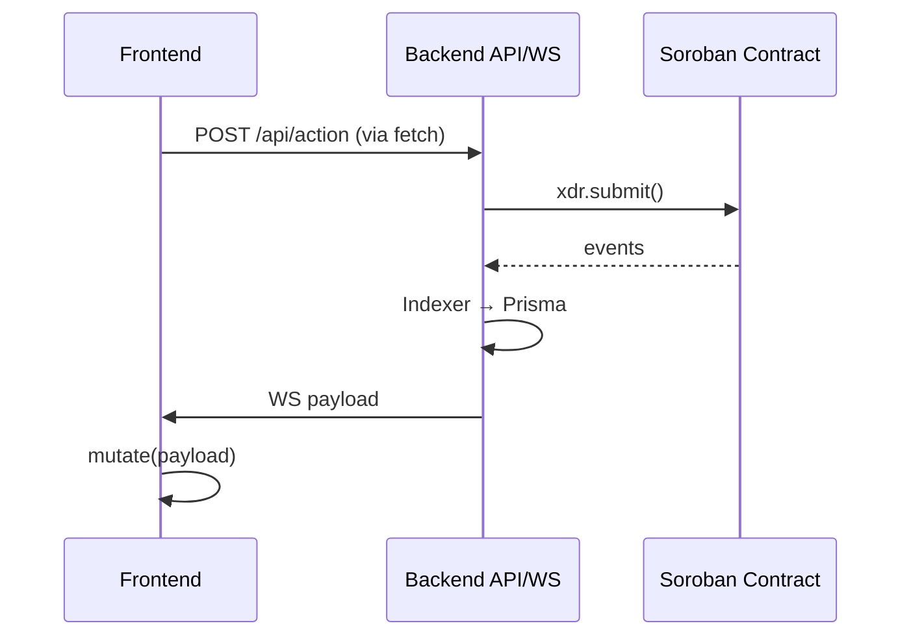

# Frontend State Management Patterns

Comprehensive guide to state management in the Stellar Trust Escrow frontend. Covers data fetching, real-time updates, global state, optimistic patterns, error handling, loading states, synchronization with backend/contracts, performance, and testing.

## Table of Contents

- [Data Fetching with SWR](#data-fetching-with-swr)
- [Real-time Updates with WebSockets](#real-time-updates-with-websockets)
- [Global Application State](#global-application-state)
- [Optimistic Updates](#optimistic-updates)
- [Loading & Skeleton States](#loading--skeleton-states)
- [Error Boundaries & Handling](#error-boundaries--handling)
- [State Synchronization](#state-synchronization)
- [Performance Optimizations](#performance-optimizations)
- [Testing Patterns](#testing-patterns)

## Data Fetching with SWR

Primary library: **SWR** (not React Query). Stale-while-revalidate, automatic retries, polling.

### Core Hook Pattern (`useEscrow`)

```jsx
'use client';

import useSWR from 'swr';

const API_URL = process.env.NEXT_PUBLIC_API_URL || 'http://localhost:4000';
const fetcher = (url) => fetch(url).then((r) => r.json());

export function useEscrow(id) {
  const { data, error, isLoading, mutate } = useSWR(
    id ? `${API_URL}/api/escrows/${id}` : null,
    fetcher,
    {
      refreshInterval: 30_000, // Poll every 30s
      refreshWhenHidden: false, // Pause when tab hidden
    },
  );
  return { escrow: data, isLoading, error, mutate };
}
```

**Usage** (in `/app/escrow/[id]/page.jsx`):

```jsx
const { escrow, isLoading, mutate } = useEscrow(id);
if (isLoading) return <EscrowCardSkeleton />;
const handleRefresh = () => mutate(); // Triggers re-fetch
```

**TODO Hooks** (`useReputation`, `useUserEscrows`, `useEscrowList`): Implement similarly (Issue #39). `useReputation` should cache aggressively (`revalidateOnFocus: false`).

## Real-time Updates with WebSockets

Custom `useEscrowUpdates` hook for per-escrow rooms (`escrow:${id}`).

### Hook Implementation (`useEscrowUpdates.js`)

```jsx
export function useEscrowUpdates(escrowId, { authToken, address, enabled = true, onEvent }) {
  // ... WS lifecycle: connect/reconnect (exp backoff + jitter), subscribe/unsubscribe
  // States: 'idle'|'connecting'|'connected'|'reconnecting'|'disconnected'
  // Returns: { status, lastPayload, lastError, topic }
}
```

**Key Features**:

- Auto-derives WS URL from API_URL.
- Exponential backoff reconnect (up to 30s + jitter).
- Auth/address gating.
- Cleanup unsubscribe on unmount/disable.

**Usage**:

```jsx
const updates = useEscrowUpdates(escrowId, {
  authToken,
  address,
  onEvent: (payload) => mutate(payload),
});
if (updates.status === 'connected') console.log(updates.lastPayload);
```

## Global Application State

Custom Zustand-like store with persistence.

### Store (`app-store.jsx` + `state.js`)

- `useReducer` + selective localStorage sync (`ste-app-store`).
- Slices: `wallet` (Freighter connect), `admin` (API key).
- DevTools integration.

**Hooks**:

```jsx
export function useWalletStore() {
  /* { address, isConnected, connect, ... } */
}
export function useAdminStore() {
  /* { apiKey, setApiKey, isAuthenticated } */
}
```

**Persistence**:

```js
// Only serializable fields persisted
export function selectPersistedState(state) {
  /* strips transient like isConnecting */
}
```

## Optimistic Updates

**Current**: Manual `mutate()` post-mutation.

```jsx
// After backend/contract action:
await fetch('/api/escrows/123/approve');
await mutate(); // Optimistically refresh from cache/backend
```

**Future**: `mutate(optimisticData, { revalidate: false })` for true optimism.

## Loading & Skeleton States

**Primitives** (`ui/Skeleton.jsx`): Variants (text/heading/image), Tailwind animate-pulse.
**Composites**: `EscrowCardSkeleton`, `CardSkeleton`, `DataTableSkeleton`, `PageSkeleton`.

**Dynamic Imports**:

```jsx
const StatWidgets = dynamic(() => import('./StatWidgets'), {
  loading: () => <div className=\"grid ...\"><CardSkeleton /></div>
});
```

## Error Boundaries & Handling

**Global** (`layout.jsx`):

```jsx
<ErrorBoundary>
  <main>{children}</main>
</ErrorBoundary>
```

**Class Component** (`ErrorBoundary.jsx`):

```jsx
class ErrorBoundary extends React.Component {
  componentDidCatch(error, info) {
    console.error('ErrorBoundary:', error, info);
    // Sentry.captureException(error);
  }
  render() {
    if (this.state.hasError) return <ErrorAlert retry={this.reset} />;
    return this.props.children;
  }
}
```

**Hook Errors**: Exposed via `error` (SWR/WS), paired with `RetryButton`.

## State Synchronization

**API Polling** (SWR 30s) + **WS Events** (`useEscrowUpdates`).
**Backend → Frontend**: WS payloads trigger `mutate(payload)` in `onEvent`.
**Contracts → Backend**: Indexer → Prisma → API/WS.
**Frontend → Backend/Contracts**: `signTx` → backend relay → events → WS back to client.

**Full Flow** (mermaid):



## Performance Optimizations

- **SWR**: `refreshWhenHidden: false`, conditional keys (null → no fetch).
- **Store**: Minimal re-renders (memoized actions/selectors).
- **Persistence**: Selective (no transient states).
- **Lazy**: Dynamic imports + skeletons.
- **WS**: Reconnect jitter, cleanup.
- **Tips**: Use `shallow` comparator for lists, `useCallback` actions.

## Testing Patterns

**Hooks** (`renderHook` + mocks):

```jsx
// useEscrow.test.js
test('loading state', () => {
  useSWR.mockReturnValue({ isLoading: true });
  const { result } = renderHook(() => useEscrow(1));
  expect(result.current.isLoading).toBe(true);
});

// useEscrowUpdates.test.js
global.WebSocket = class MockWebSocket {
  /* mocks lifecycle */
};
```

**Store** (`renderWithStore` wrapper).

**Acceptance**: All examples work, sync scenarios covered via mocks.

---

_Updated: $(date)_ | [Edit on GitHub](https://github.com/Stellar-Trust-Escrow/stellar-trust-escrow/blob/main/docs/frontend-state-management.md)
