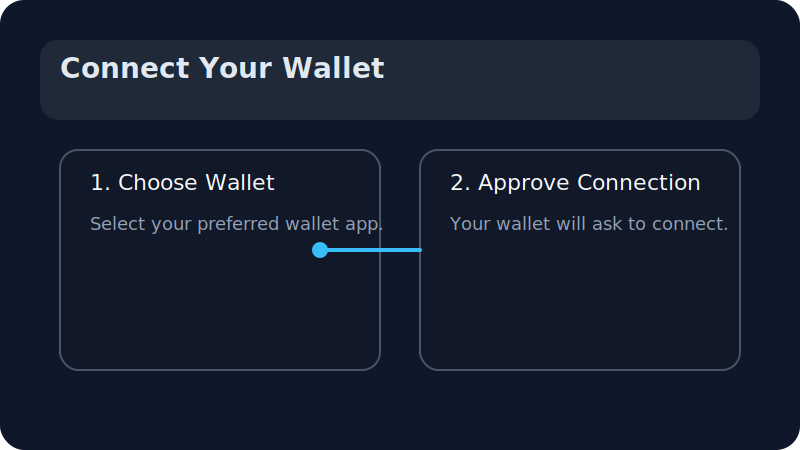
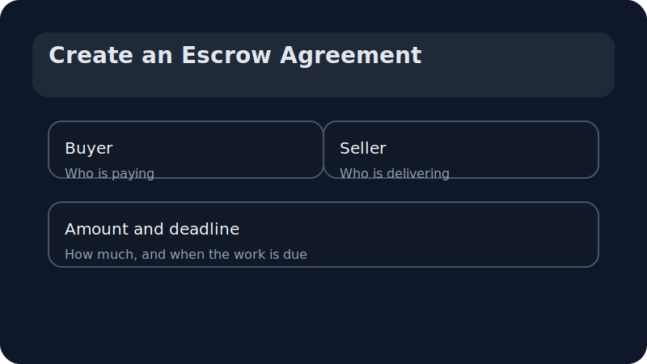
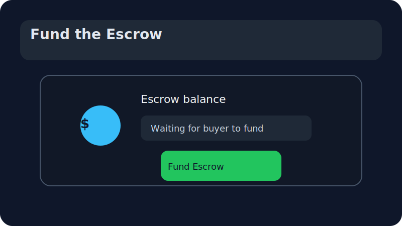
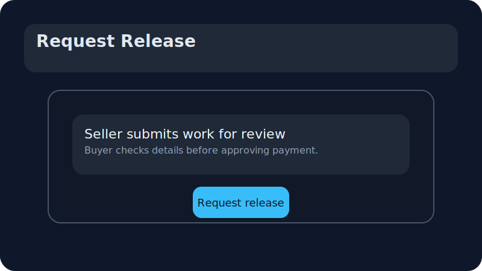
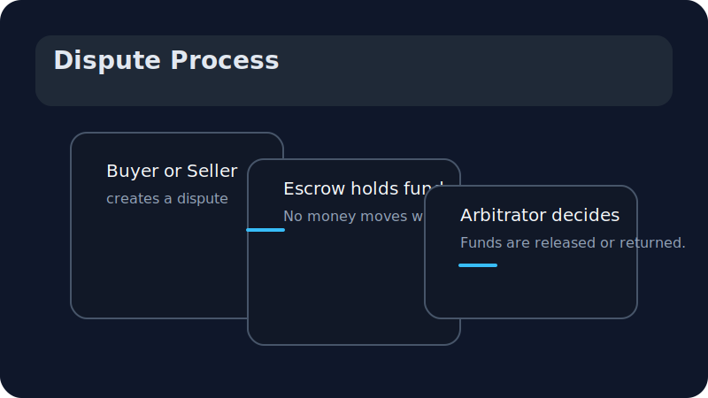

# Stellar Trust Escrow: Buyer and Seller User Guide

This guide helps buyers and sellers use Stellar Trust Escrow with confidence.
It explains how to connect a wallet, create a secure escrow agreement, fund the escrow, request payment, and handle a dispute.
No prior blockchain experience is required.

---

## 1. What is Stellar Trust Escrow?

Stellar Trust Escrow is a place where funds are held safely until both buyer and seller agree that work is complete.
That means:

- Buyers do not send money directly to the seller before work is done.
- Sellers can complete work knowing the funds are already set aside.
- If there is a disagreement, the money stays in escrow until the issue is resolved.

> Think of escrow like a trusted holding box. The buyer puts money in the box, the seller finishes the work, and then the money is released once both sides agree.

---

## 2. Connect your wallet

Before you can use Stellar Trust Escrow, you must connect a wallet.
A wallet is a secure app or browser extension that stores your account and lets you approve transactions.

### Why connect a wallet?

- It proves who you are without a username and password.
- It allows the app to ask your wallet to confirm actions safely.
- It keeps your funds under your control.

### How to connect

1. Click the **Connect Wallet** button.
2. Choose the wallet app or extension you already use.
3. Approve the connection when your wallet asks.

> If your wallet does not appear, check that it is installed and unlocked.

---

## 3. Create an escrow agreement

An escrow agreement is the promise both sides make about the work, payment, and timeline.

When you create an escrow, you will set:

- **Who is paying** (buyer)
- **Who is delivering the work** (seller)
- **How much money** will be held
- **What will be delivered**
- **A deadline** for when the work should be done

### Setting the terms

Use the app form to type in the agreement details.
Make these points clear:

- What the seller will deliver.
- What the buyer expects.
- When the work should be finished.

### Choosing the amount

Enter the exact amount of money you both agree on.
This amount is the money that will be held in escrow until release.

### Choosing the deadline

The deadline is the latest date when the seller should complete the work.
If the deadline passes and the buyer is not satisfied, the buyer can open a dispute and ask for help.

> The deadline is not the same as the release date. It is the time by which the work should be finished.

---

## 4. Fund the escrow

Once the escrow is created, the buyer must place the agreed funds into escrow.
This keeps the money safe while the seller works.

### The funding steps

1. Click the **Fund Escrow** button.
2. Confirm the payment request in your wallet.
3. Wait for the app to show the escrow is funded.

### What happens to the money?

The money is moved into the escrow contract, not sent directly to the seller.
The seller cannot take the money until it is released.

---

## 5. Request release when the work is ready

When the seller finishes the agreed work, they can ask the buyer to release payment.

### Seller action

- The seller clicks **Request Release** or **Submit Work**.
- The buyer receives a notification to review the work.

### Buyer action

- The buyer checks the completed work.
- If the buyer agrees, they approve the release.
- The money is then sent to the seller.

### If the buyer does not approve yet

If the buyer believes the work is not complete, they can keep the escrow open and discuss the issue with the seller.

---

## 6. What happens on dispute

A dispute is a safety tool when buyer and seller cannot agree.

### When to open a dispute

Open a dispute if:

- The seller did not deliver the agreed work.
- The buyer received something different than expected.
- The deadline passed and the issue is still unresolved.

### What the dispute does

- The money stays in escrow.
- Both sides can upload evidence.
- An arbitrator reviews the case and decides whether funds should be released or returned.

### Dispute outcome

Possible outcomes:

- The buyer gets the money back.
- The seller receives the money.
- The funds are split if the arbitrator decides that is fair.

---

## 7. What does “signing a transaction” mean?

When the app says you need to sign a transaction, it is asking your wallet to confirm your choice.

### Simple explanation

- The app prepares a request to move or approve funds.
- Your wallet shows the request and asks if it is okay.
- You approve it with a button click, fingerprint, or password.

### Why signing matters

Signing is like saying:

- “Yes, I want to do this.”
- “Yes, I agree with this payment or action.”

Your wallet never asks for your secret password in the app.
It only asks you to confirm the action in a secure way.

---

## 8. Quick checklist for buyers and sellers

### For buyers

- Make sure the escrow terms are clear.
- Confirm the amount before funding.
- Check the deadline and expected delivery.
- Approve the release only after the work is complete.

### For sellers

- Describe the work clearly in the agreement.
- Fund the escrow request from the buyer before you start.
- Ask for release only when the work matches the agreed terms.
- Keep proof of what you delivered in case of a dispute.

---

## 9. Where to find more help

If you need more details, this guide is stored in the repository under:

`docs/user-guide/getting-started.md`

You can also open the app Help section for step-by-step support.
